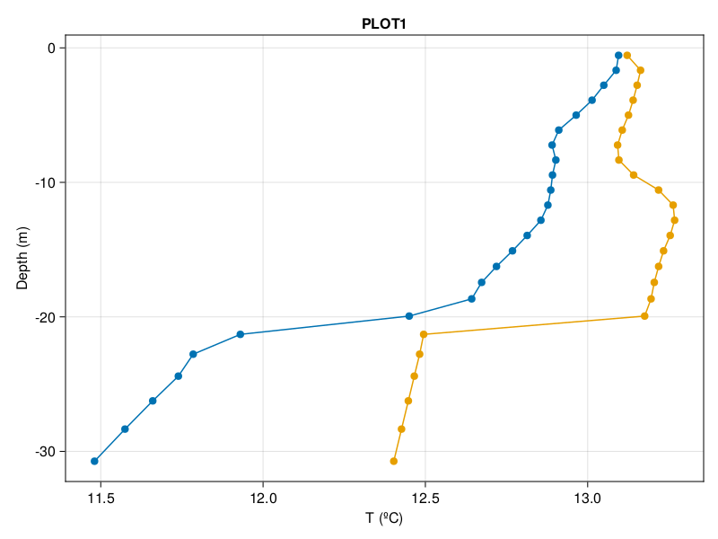
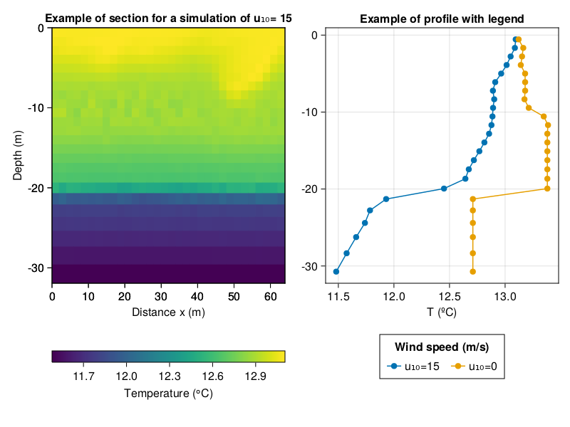

# **Modelization of the deep water formation**

Victor Garcia (@Victor-Garcia-p), 2023-03-17

## Content

* [Install the repository](#install-the-repository)
* [Load the project environment](#load-the-project-environment)
* [Create a model](#create-a-model)
* [Plot a simulation](#plot-a-simulation)
* [Gallery](#gallery)
* [Documentation of model folder](#documentation-of-model-folder)
* [Documentation of plots folder](#documentation-of-plots-folder)
* [Need more help?](#need-more-help)
* [References](#references)

## Install the repository

This steps only needs to be done once:

### 1. Download [Julia](https://julialang.org/downloads/)

### 2. Make a copy of the repository from Github

```julia
$git clone https://github.com/Victor-Garcia-p/TFG.git
```

More [help](https://docs.github.com/en/repositories/creating-and-managing-repositories/cloning-a-repository)

### 3. Install [DrWatson](https://github.com/JuliaDynamics/DrWatson.jl) package

This is an optional step, but will help to do initialize the project and load the project environment

```julia
julia> using Pkg
julia> Pkg.add("DrWatson")
```

### 4. Initialize the project

```julia
julia> using DrWatson
julia> initialize_project("DWF_model")
```

Note: _You may need to add the path to the project. See more help [here](https://juliadynamics.github.io/DrWatson.jl/v2.8/project/#Initializing-a-Project-1)_

## Load the project environment

Before runing any script, load the project environment. The use of DrWatson is opcional but recomended

```julia
julia> using DrWatson
julia> @quickactivate
```

## Create a model

To create a simulation use `model_execution.jl` following this steps:

1. Load the required packages (defined at 'model_functions.jl')

   ```julia
   julia> include("model_functions.jl")
   ```

2. Set the layers of the model
    * Define properties of each layer using  `WaterLayer()`. For each of them, enter values of maximum depth, T and S
    * Add all layers in an [Array]  
  
    ---

    **Example**  
        A model with 3 layers, each of 10 m and different TS

    ```julia
   SW_layer = WaterLayer(10.0, 37.95, 13.18)
    LIW_layer = WaterLayer(20.0, 38.54, 13.38)
    WMDW_layer = WaterLayer(grid.Lz, 38.41, 12.71)

    layers = [SW_layer,LIW_layer,WMDW_layer]
   ```

    _Note: `grid.Lz` is the maximum depth of the grid_

3. Set the constants of models and simulations in separated `Dict()`. If not defined, taken as default

    ---

    **Example**

    Define a single run with u₁₀ = 10m/s, dTdz =0.01 °C/m that last 1440 minutes.
  
    ```julia
    model_arguments = [Dict(:u₁₀=>0, :dTdz=>0.01)]

    simulation_arguments= [Dict(:t=>1440minutes)]
   ```

   *Multiple runs: Add another `Dict()` at the vector

4. Run the model using a loop that gives the parameters to the functions of the model. See [`model_functions.jl`](#model_functionsjl) for more info

    ```julia
   for kwargs in model_arguments, kwargs2 in simulation_arguments
    build_model(layers;kwargs...,kwargs2...)
    prepare_simulation!(params,model;kwargs2...)
    
    run!(simulation)
    end
   ```

## Plot a simulation

The following example is part of `section_example.jl` at the folder _example_plots_

### 1. Loading the functions

If not done before load the [project environment](#load-the-project-environment), then load `plots_functions.jl` with all the functions

```julia
include("plots_functions.jl")
```

### 2. Load the files and its parameters

Use load_files with a **(.)** for multiple simulations. The name must be written without (.jld2) and all files should be located at _"DWF_model\data"_ folder.

```julia
file_names = ["3WM_u₁₀=15_S=35.0-35.0-35.0_dTdz=0.04_T=13.18-13.38-12.71_dim=2D_t=1200.0",
"3WM__u₁₀=0_S=37.95-38.54-38.41_dTdz=0.01_T=13.18-13.38-12.71_dim=2D_t=43200.0"]
results = load_files.(file_names)
```

### 3. Define the area (AOI)

Each type of plot requires a different imput of data (see  [`plots_functions.jl`](#plot_functionsjl)). For a `section()`  **y** and **t** should be fixed

```julia
variable_plot = define_AOI(:, 16, :, 21) 
```

### 4. Display the figure

To plot a single figure with default parameters simply use the function

```julia
profile(variable_plot[:data],results[1][:zT],[1,1],true)
display(fig)
```

![Profile of ["3WM_u₁₀=15_S=35.0-35.0-35.0_dTdz=0.04_T=13.18-13.38-12.71_dim=2D_t=1200.0",
"3WM__u₁₀=0_S=37.95-38.54-38.41_dTdz=0.01_T=13.18-13.38-12.71_dim=2D_t=43200.0"] with default values](code_plots/example_plots/profile_default.png)

To costumizate the figure, like adding a title and labels, simply add into `Theme()` (more info about this [here](https://docs.makie.org/stable/documentation/theming/index.html#example_17370679024465238660)).

```julia
themes=
    Theme(
        Axis = (
            xlabel="T (ºC)",
            ylabel="Depth (m)",
            title = "PLOT1"))

with_theme(themes) do

    profile(variable_plot[:data],results[1][:zT],[1,1],true)
    
end
fig
```



## Gallery

Those are some more complex examples that show what can be done with the code. Each of them can be found at _example_plots_ folder

### Multiple figures



### Video of the simulations

* see the video at youtube

## Documentation of model folder

### **Name syntax**

For all the model the following syntax is used

#### _Name=3WM_variables=values_

Where _variables_ are separed with (,) and follow the order: wind speed (u₁₀), salinity of each layer separed with (-), temperature gradient (dTdz), dimension of the simulation (2D or 3D) and maximum time (t)

### `grid_generation.jl`

Use: creates the grid for the model considering a linear sparcing at x,y and a
variable resolution at z.

### `model_execution.jl`

Use: Set the model with the defined constants and safe the results in a .jld2 file.

Imput: `grid_generation.jl` and `model_functions.jl`

Output: A simulation.jld2 with information about velocity (in 3 dimensions), tracers (T,S) and eddy_viscosity. The name is created following [this](#name-syntax) syntax.

### `model_functions.jl`

Use: Contains the model splitted into functions

## Documentation of plots folder

### `plot_functions.jl`

Use: Contains all the functions needed to plot

### Taylor diagram

To create this plot first run `taylor_dataframe.jl` to make the statistics required, then use `taylor_plot.py` to make the plot

## Need more help?

1. For specific documentation of a function use `REPL ?` help mode

    ```julia
    help?> load_files
    ```

2. For bug reports, post an "issue" in the code repository

3. For constributions to the code, make a "pull request" in the code repository.

## References

* Model based on `ocean_wind_mixing_and_convection.jl` from Oceananigans de (Ramadhan et al., (2020)
* `taylor_plot.py` is modified from Yannick Copin (2018)
