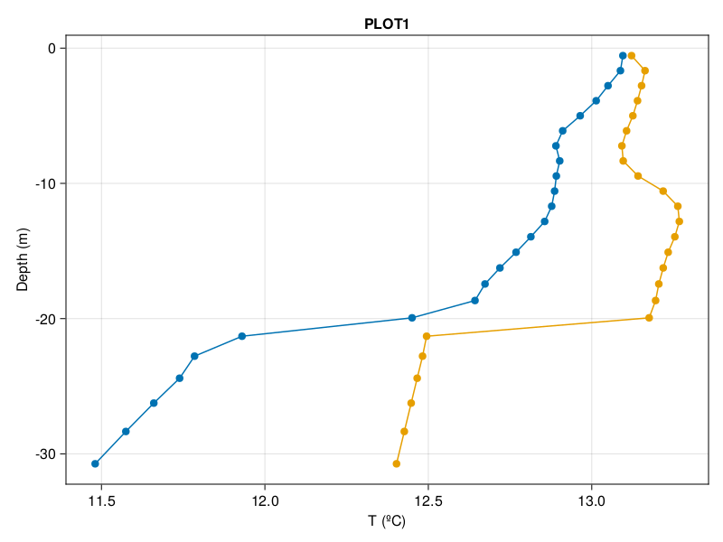

# Modelization of the deep water formation

Victor Garcia (@Victor-Garcia-p), 2023-03-17

## Content

* ...

## Install the model

### 1. Download [Julia](https://julialang.org/downloads/)

### 2. Make a copy of the repository

```julia
$git clone https://github.com/Victor-Garcia-p/TFG.git
```

### 3. Install [DrWatson](https://github.com/JuliaDynamics/DrWatson.jl) package

```julia
julia> using Pkg
julia> Pkg.add("DrWatson")
```

### 4. Load the project environment

```julia
julia> using DrWatson
julia> @quickactivate
```

## Creating a model

To create a simulation use `model_execution.jl` following this steps:

1. Load the required packages (defined at 'model_functions.jl')

   ```julia
   julia> include("model_functions.jl")
   ```

2. Set the layers of the model
    * Define properties of each layer using  `WaterLayer()`. For each of them, enter values of maximum depth, T and S
    * Add all layers in an [Array]  
  
    ---

    **Example**  
        A model with 3 layers, each of 10 m and different TS

    ```julia
   SW_layer = WaterLayer(10.0, 37.95, 13.18)
    LIW_layer = WaterLayer(20.0, 38.54, 13.38)
    WMDW_layer = WaterLayer(grid.Lz, 38.41, 12.71)

    layers = [SW_layer,LIW_layer,WMDW_layer]
   ```

    _Note: `grid.Lz` is the maximum depth of the grid_

3. Set the constants of models and simulations in separated `Dict()`. If not defined, taken as [default](#default-values)

    **Example**

    Define a single run with u₁₀ = 10m/s, dTdz =0.01 °C/m that last 1440 minutes.
  
    ```julia
    model_arguments = [Dict(:u₁₀=>0, :dTdz=>0.01)]

    simulation_arguments= [Dict(:t=>1440minutes)]
   ```

   More info: [multiples_runs](#multiples-runs)

4. Run the model using a loop that gives the parameters to the functions of the model. See [`model_functions.jl`](#model_functionsjl) for more info

    ```julia
   for kwargs in model_arguments, kwargs2 in simulation_arguments
    build_model(layers;kwargs...,kwargs2...)
    prepare_simulation!(params,model;kwargs2...)
    
    run!(simulation)
    end
   ```

## Ploting a simulation

These a

### 1. Loading the functions

If not done before load the [project environment](#4-load-the-project-environment), then load `plots_functions.jl` with all the plots and the grid of the model

```julia
include("plots_functions.jl")
include(joinpath(@__DIR__, "..", "code_model/grid_generation.jl"))
```

### 2. Load the files and its parameters

Use load_files and read_parameter functions with a **(.)** for multiple simulations

```julia
file_names = ["3WM_u₁₀=15_S=35.0-35.0-35.0_dTdz=0.04_T=13.18-13.38-12.71_dim=2D_t=1200.0",
"3WM__u₁₀=0_S=37.95-38.54-38.41_dTdz=0.01_T=13.18-13.38-12.71_dim=2D_t=43200.0"]
results = load_files.(file_names)
parameters = read_parameters.(file_names)
```

_*Note: Write the full name without (.jld2).Files should be located at "DWF_model\data" folder._

### 3. Define the area (AOU)

Each type of plot requires a different imput of data (see  [`plots_functions.jl`](#plot_functions)). For a `section()`  **y** and **t** should be fixed

```julia
variable_plot = define_AOI(:, 16, :, 21) 
```

### 4. Display the figure

To plot a single figure with default parameters simply use the function

```julia
profile(variable_plot,zT,[1,1],true)
fig
```

![Profile of ["3WM_u₁₀=15_S=35.0-35.0-35.0_dTdz=0.04_T=13.18-13.38-12.71_dim=2D_t=1200.0",
"3WM__u₁₀=0_S=37.95-38.54-38.41_dTdz=0.01_T=13.18-13.38-12.71_dim=2D_t=43200.0"] with default values](code_plots/example_plots/section_default_README.png)

To costumizate the figure, like adding a title and labels, simply add into `Theme()` (more info about this [here](https://docs.makie.org/stable/documentation/theming/index.html#example_17370679024465238660)).

```julia
themes=
    Theme(
        Axis = (
            xlabel="T (ºC)",
            ylabel="Depth (m)",
            title = "PLOT1"))

with_theme(themes) do

    profile(variable_plot,results[1][:zT],[1,1],true)
    
end
fig
```



## Gallery

Those are some more complex examples to check what can be done with the code. Each example can be found at _example_plots_ folder to ensure replication

### Example 1

### Example 2

## Documentation of **model** files

### `model_execution.jl`

Funcionalitat/descripció:
imput: Batimetry from EMODNET (Batimetry_D5_2020.nc)
output: The map, printed in "plot" section
comments: Some parts of the code are adapted from other authors, please
see the references at the main work pdf.

### `grid_generation.jl`

### `model_functions.jl`

#### Default values

v=0m/s

#### Multiples runs

a

## Documentation of **plot** files

## `plot_functions`

a

## References and contributions

a
